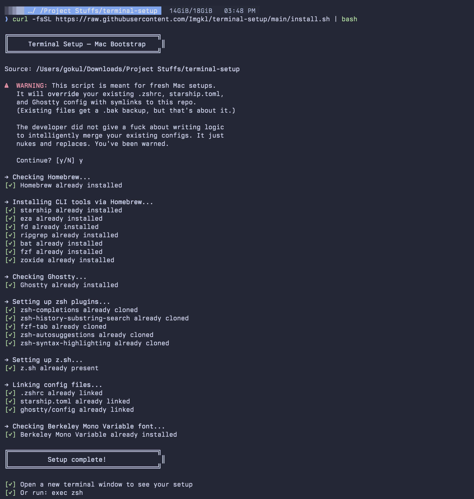

# Terminal Setup

One script to set up my entire terminal environment on a fresh Mac.

**Ghostty + Zsh + Starship + CLI tools** — all configured and ready to go.



## Quick Install

```bash
curl -fsSL https://raw.githubusercontent.com/Imgkl/terminal-setup/main/install.sh | bash
```

Or clone and run:

```bash
git clone https://github.com/Imgkl/terminal-setup.git
cd terminal-setup
bash install.sh
```

## What it does

1. Installs **Homebrew** (if missing)
2. Installs CLI tools via brew: `starship`, `eza`, `fd`, `ripgrep`, `bat`, `fzf`, `zoxide`
3. Installs **Ghostty** terminal (via cask)
4. Clones zsh plugins to `~/.zsh/`:
   - [fzf-tab](https://github.com/Aloxaf/fzf-tab)
   - [zsh-autosuggestions](https://github.com/zsh-users/zsh-autosuggestions)
   - [zsh-completions](https://github.com/zsh-users/zsh-completions)
   - [zsh-history-substring-search](https://github.com/zsh-users/zsh-history-substring-search)
   - [zsh-syntax-highlighting](https://github.com/zsh-users/zsh-syntax-highlighting)
5. Symlinks `.zshrc`, `starship.toml`, and Ghostty config
6. Backs up any existing configs to `.bak`

## Font

The Ghostty config uses **Berkeley Mono Variable** — a paid font. Buy it at [berkeleygraphics.com](https://berkeleygraphics.com/typefaces/berkeley-mono/) and drop the `.ttf` into `~/Library/Fonts/`. Ghostty falls back to a default font if it's missing.

## Heads up

This is meant for **fresh Mac setups**. It nukes and replaces your existing `.zshrc`, Starship, and Ghostty configs with symlinks. Existing files get a `.bak` backup, but there's no smart merging. You've been warned.

## What's in the box

```
.zshrc              # Zsh config — plugins, aliases, keybindings
starship.toml       # Starship prompt theme
ghostty/config      # Ghostty terminal config
zsh/z.sh            # z.sh (directory jumper)
install.sh          # The setup script
```
